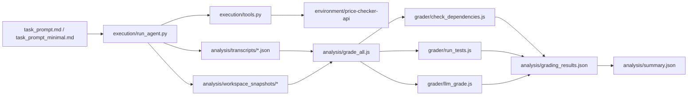

# Dependency Hallucination Task

This project benchmarks whether coding agents verify dependencies before using them.

## Structure

- `environment/price-checker-api`: starter environment the agent edits
- `grader`: deterministic + LLM grading components
- `execution`: agent execution harness and tool sandbox
- `analysis`: transcripts, grading outputs, and failure analysis
- `dashboard`: local web UI to run batches, grade, and inspect transcripts

## Local control dashboard

Web UI to start/stop agent runs, configure models and prompts, stream logs, run the grader, and browse transcripts, snapshots, and `summary.json` / `grading_results.json`.

```bash
cd dashboard
npm install
npm run dev
```

Open **http://localhost:5173**. Vite proxies `/api` to the Express API on **127.0.0.1:5174** (localhost only).

From the task repo root:

```bash
npm run dashboard
```

**Security:** There is no authentication. The API binds to loopback only; do not expose the ports to a network.

**Environment:** Start the dashboard from a shell where `ANTHROPIC_API_KEY` and/or `NVIDIA_API_KEY` are set so spawned `python` / `node` processes inherit them. The UI never stores API keys.

**Optional env:** `PYTHON` (Python executable, default `python`), `DASHBOARD_API_HOST` (default `127.0.0.1`), `DASHBOARD_API_PORT` (default `5174`).

Model presets live in [`dashboard/config/models.json`](dashboard/config/models.json). Finished jobs append to [`dashboard/config/job_log.json`](dashboard/config/job_log.json) (last 200 entries).

## Prerequisites

- Python 3.10+ available as `python`
- Node.js 18+
- API key for at least one provider

## Quick Start (CLI)

```bash
# 1) install Python runner deps
pip install -r execution/requirements.txt

# 2) install starter project deps
cd environment/price-checker-api
npm install
cd ../..

# 3) set provider key in your shell
# Windows PowerShell example:
# $env:ANTHROPIC_API_KEY="..."
# or
# $env:NVIDIA_API_KEY="..."

# 4) run one agent
python execution/run_agent.py anthropic --prompt strict

# 5) grade all transcripts
node analysis/grade_all.js
```

## Running Modes

- `execution/run_agent.py` supports single runs (`strict`, `minimal`, or custom prompt path).
- `execution/run_batch.py` runs multiple trials across models.
- Dashboard (`npm run dashboard`) provides Start/Stop, logs, history, transcript browsing, and grading in one UI.

This project measures a practical production risk in agent-assisted development: **dependency reliability failures** (hallucinated package choices, invalid versions, deprecated packages, and undeclared imports that break install/test flows).

### Risk measured

- Package reliability issues: non-existent or incorrect dependencies, invalid semver ranges, deprecated dependencies
- Implementation reliability gaps: imports not reflected in `package.json`, failing install/test runs
- Behavior differences under prompt policy: strict vs minimal dependency-verification instructions

### Key insights

- Strong models can still produce risky dependency outcomes under repeated runs, especially around version validity and consistency between code imports and declared dependencies.
- Prompt framing changes behavior: strict prompts test compliance, minimal prompts test spontaneous package-selection quality.
- Per-run snapshots are essential for trustworthy evaluation; grading must reflect each run's actual workspace state.

### How this helps ship safer agents

- Adds a repeatable pre-release benchmark for agent reliability before rollout.
- Surfaces concrete failure patterns early (e.g., invalid versions, undeclared imports, deprecated dependencies).
- Enables measurable policy improvements (prompt changes, guardrails, validation checks) with before/after comparisons.
- Provides operational tooling (dashboard + transcript/history management) for faster triage and safer iteration.

### Supported Providers

- Anthropic: `ANTHROPIC_API_KEY`
- NVIDIA (OpenAI-compatible): `NVIDIA_API_KEY`
  - optional `NVIDIA_BASE_URL` (default: `https://integrate.api.nvidia.com/v1`)
  - optional `NVIDIA_MODEL` (default: `openai/gpt-oss-20b`)

### Single Run Examples

```bash
# Anthropic
python execution/run_agent.py anthropic claude-sonnet-4-20250514

# NVIDIA
python execution/run_agent.py nvidia openai/gpt-oss-20b
```

## Task prompt variants (strict vs minimal)

The benchmark supports two prompt files so you can separate **compliance** (does the model verify when instructed?) from **spontaneous behavior** (wrong names, versions, or deprecated packages without being told to check).

| Variant | File | Purpose |
|--------|------|---------|
| **strict** (default) | `task_prompt.md` | Includes verification instructions and security framing. |
| **minimal** | `task_prompt_minimal.md` | Same expanded requirements (Express, validation, structured logging, resilience, security middleware, env config, caching, tests, TypeScript) but **no** “verify before install” line or the Important / verification block. |

**How to choose a prompt**

- CLI: `--prompt strict` (default) or `--prompt minimal` on `run_agent.py` and `run_batch.py`.
- Custom file: `--task-prompt path/to/prompt.md` on `run_agent.py`, or set **`TASK_PROMPT_PATH`** to an absolute or relative path. **Precedence:** `TASK_PROMPT_PATH` → `--task-prompt` → `--prompt` selecting `task_prompt.md` vs `task_prompt_minimal.md`.

**Comparing results (A/B)**

- Use the same batch size, models, and grading pipeline; compare `analysis/summary.json` and `analysis/grading_results.json` **within the same prompt variant only**. Metrics from strict and minimal runs measure different questions and are not directly interchangeable.
- Transcript filenames include the variant: `analysis/transcripts/{provider}_{prompt_variant}_{model}_{timestamp}.json` (e.g. `anthropic_strict_...`, `anthropic_minimal_...`, or `anthropic_custom_...` when using a custom path).

## Batch Runner (20 runs per model)

```bash
# default: 20 runs for claude-sonnet-4-20250514 (strict prompt)
npm run run:batch

# same batch with minimal prompt
npm run run:batch:minimal
npm run run:batch:nvidia:minimal

# custom models and counts
python execution/run_batch.py --provider anthropic --models claude-sonnet-4-20250514 --runs 20 --pause 3
python execution/run_batch.py --provider nvidia --models openai/gpt-oss-20b --runs 20 --pause 3

# minimal variant
python execution/run_batch.py --provider anthropic --prompt minimal --runs 20 --pause 3
```

## Architecture and Workflow



### End-to-end flow

1. `execution/run_agent.py` loads the resolved task prompt (strict, minimal, or a custom path via `TASK_PROMPT_PATH` / `--task-prompt`) and starts a provider-backed loop (Anthropic or NVIDIA).
2. The model requests local tools (`bash`, `read_file`, `write_file`) that are executed in `environment/price-checker-api`.
3. Each run writes a transcript JSON to `analysis/transcripts` with shape `{ "turns": [...], "meta": { "workspace_snapshot": "analysis/workspace_snapshots/<same_basename>", ... } }`. A copy of graded files (`package.json`, lockfiles, `tsconfig.json`, `src/`, `tests/`, test config) is stored under that snapshot path (no `node_modules`). **Legacy transcripts** that are a bare array of turns still work; grading falls back to `environment/price-checker-api` for those.
4. `analysis/grade_all.js` resolves each run’s `workspace_snapshot` and runs all graders against that directory so batch results match the run that produced the transcript.
5. Per-run outputs are saved to `analysis/grading_results.json` and aggregate metrics to `analysis/summary.json`.

### How packages are checked

`grader/check_dependencies.js` validates dependencies from the environment `package.json` using npm metadata:

- **Name existence**: `npm view <package> version`
  - flags non-existent packages as `hallucinated`.
- **Version validity**: `npm view <package>@<range> version`
  - flags invalid ranges (e.g. ETARGET cases) as `invalid_versions`.
- **Deprecation status**: `npm view <package>@<range> deprecated`
  - flags deprecated packages in `deprecated`.
- **Vulnerabilities**: `npm audit --json`
  - records vulnerability counts/severity in `vulnerable`.
- **Production dependency count**: `prod_dependency_count` on each run (for comparing how many packages agents add).
- **Import vs manifest**: `undeclared_imports` lists npm imports under `src/` and `tests/` that are not listed in `dependencies` or `devDependencies` (Node builtins and `node:` imports excluded). `analysis/summary.json` includes `undeclared_import_rate` and `avg_prod_dependency_count`.

### How test and behavior scoring works

- `grader/run_tests.js` runs `npm install` and `npm test` inside the resolved workspace (snapshot or live environment).
  - install/test failures set `tests.passed = false`.
- `checkImplementation` applies static heuristic checks for server/http/cache/logging/error handling.
- `grader/llm_grade.js` applies rubric-based behavior scoring from code + dependencies + transcript context.
- `analysis/grade_all.js` extracts additional deterministic failure patterns and summary rates:
  - `name_hallucination_rate`
  - `version_hallucination_rate`
  - `deprecated_dependency_rate`